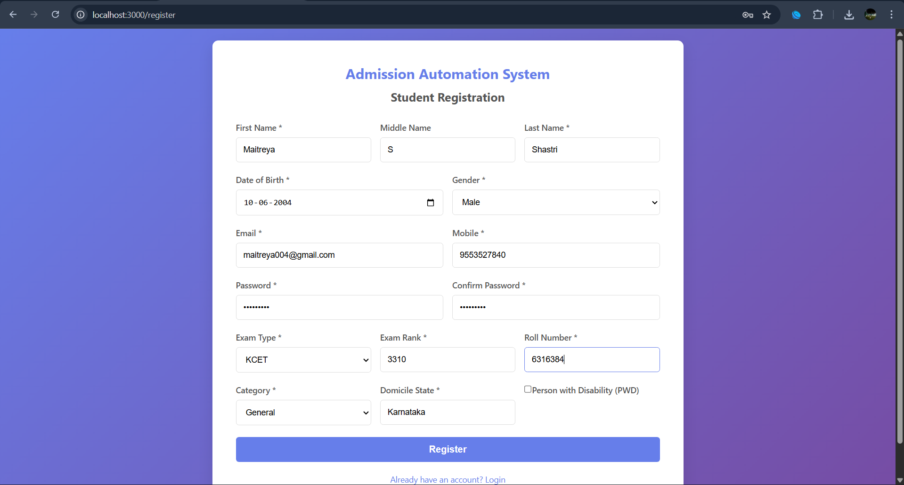
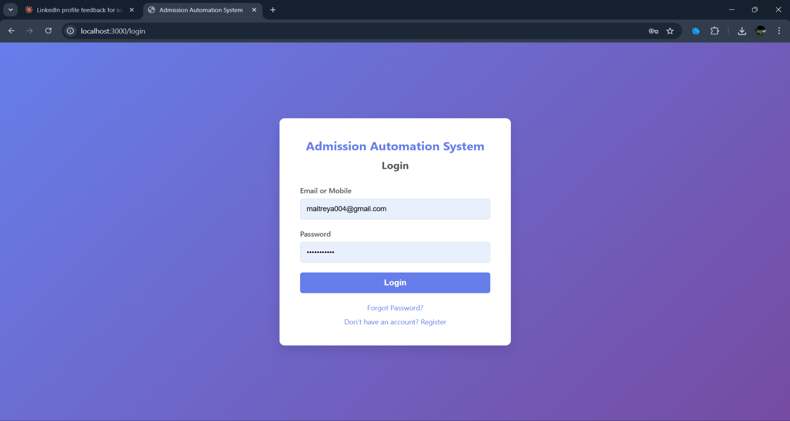
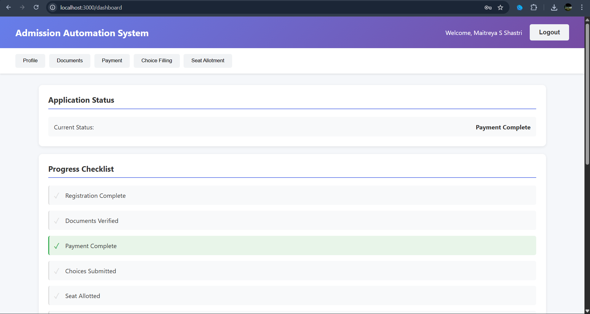
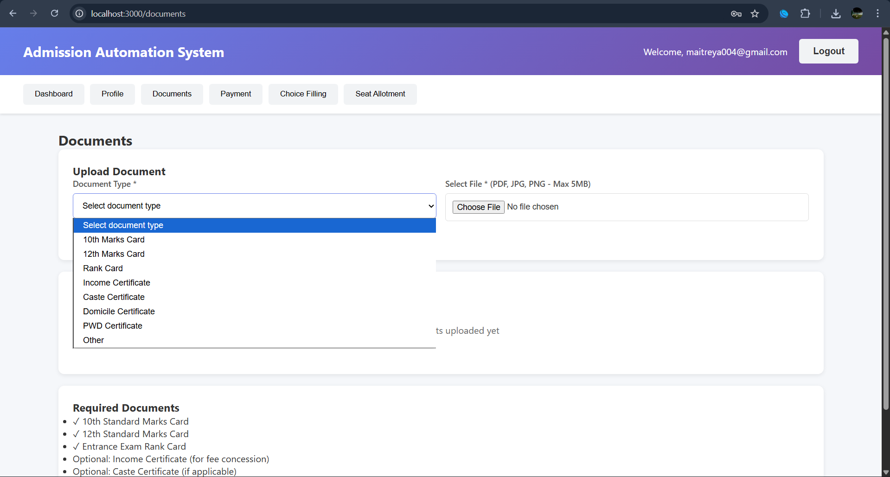
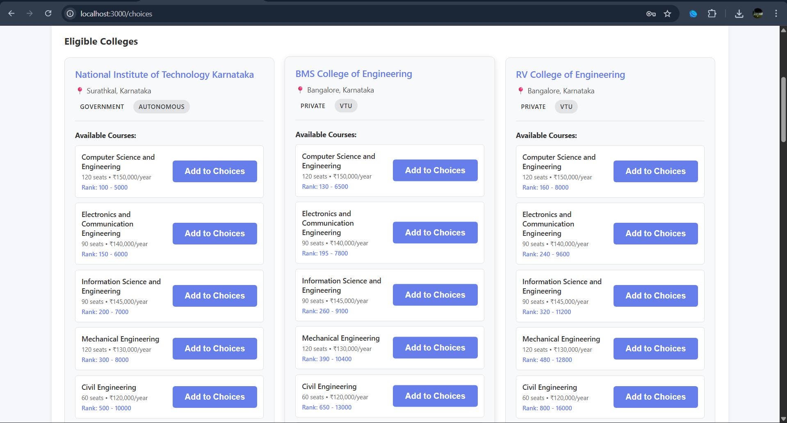
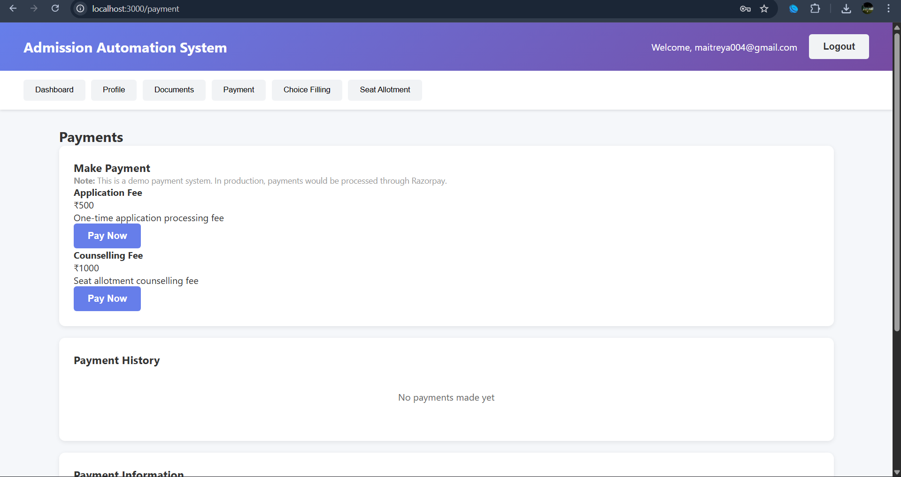
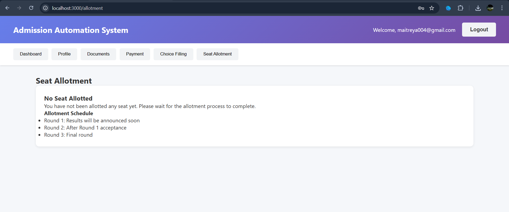

# Admission Portal — KCET & COMEDK Counselling

A full-stack web application that automates the admission counselling workflow 
for KCET and COMEDK — covering registration, document upload, seat allotment, 
and payment, replacing what is normally a manual, paperwork-heavy process.

Built as a team project (4 developers) for the UE23CS341A course at PES University.

## My Contribution
I built the core backend services:
- **Seat allotment logic** — matching engine for counselling rounds
- **Authentication** — user login/signup flow
- **Payment integration** — handling admission fee payments
- **Document & choice submission** — upload and selection handling
- **Notifications** — email and SMS services for real-time status updates

## Screenshots

**Registration**

**Login**

**Dashboard**

**Document Upload**

**Choice Filling**

**Payment (Demo Mode)**

**Seat Allotment**

## Tech Stack
React.js · Python · Flask · SQLAlchemy · JWT · Redis · Celery · Twilio · Razorpay

## Running Locally
See [QUICKSTART.md](./QUICKSTART.md) for setup instructions.

## Team
- @Sami9692 — Scrum Master
- @SamhithRGowda — Developer
- @Sahil-0788 — Developer (backend services listed above)
- @Samarth-2705 — Developer
